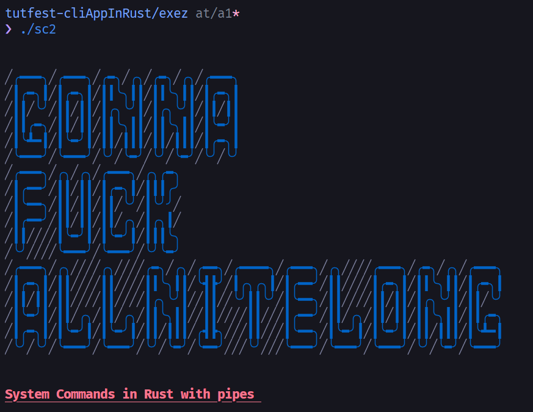

<h2 align="center"><code> cf </code></h2>
<h3 align="center"><i> Testing Banner Colors </i></h3>

----
1. [WTF ?](#wtf-)
2. [References](#references)
	1. [Cfonts Usage](#cfonts-usage)
3. [Output PIC](#output-pic)

----

# WTF ? 

> Initially this directory was sc2 , but you got fucking carried away and got stuck trying to implement the fucking colors , so now this repo is for the colors only
> Eat sweatybooty everday 

1. This is the actual repo in which you are trying to pipe sytem commands
2. This repo also implements the [cfonts](https://docs.rs/cfonts/latest/cfonts/index.html) - Which helps in making banners in the code  


# References 

Clit | Lick
|:--:|:--:|
[`std::process::Command`](https://doc.rust-lang.org/std/process/struct.Command.html) | Rust official manual, code here is referenced and learnt from here 
[`yansi`](https://docs.rs/yansi/latest/yansi/index.html) | Crage official wiki, implementation in this repo is also taken from here directly 
[`cfons`](https://docs.rs/cfonts/latest/cfonts/index.html) | Cfonts for making banners , usually you used use this for making banners via the CLI , but it can also be called in your code as a crate<br>[`Github`](https://github.com/dominikwilkowski/cfonts/tree/released)- Lot of the otpions are in here even though not mentioned in normal form in doc.rs

## Cfonts Usage 

- Real pain to use this 
- From the `config.rs`

```rs
impl Options {
	/// The default values for each of the options so you don't have to pick each option every time
	pub fn default() -> Self {
		Options {
			text: String::from(""),
			font: Fonts::FontBlock,
			align: Align::Left,
			colors: vec![Colors::System],
			background: BgColors::Transparent,
			letter_spacing: 1,
			line_height: 1,
			spaceless: false,
			max_length: 0,
			gradient: Vec::new(),
			independent_gradient: false,
			transition_gradient: false,
			env: Env::Cli,
			help: false,
			version: false,
			debug: false,
			debug_level: 1,
		}
	}
```

# Output PIC 

- note even though the director is called `cf (cfonts usage fucker)`, its actually a copy of `sc2`. 
- Compiling the bastred will give you sheet `sc2` exe, moderfoder
- It luk gud show to gurlfren, ask to pee in my face 

