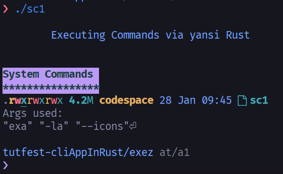

<h2 align="center"><code> sc1 </code></h2>
<h3 align="center"><i> System Commands in Rust </i></h3>

----
1. [WTF ?](#wtf-)
2. [References](#references)
3. [Output PIC](#output-pic)

----

# WTF ? 

1. Testing out system commands in piping them in rust 
2. With some work on colors and banners 
3. This isnt the goal fo thsi repo 

# References 

Clit | Lick
|:--:|:--:|
[`std::process::Command`](https://doc.rust-lang.org/std/process/struct.Command.html) | Rust official manual, code here is referenced and learnt from here 
[`yansi`](https://docs.rs/yansi/latest/yansi/index.html) | Crage official wiki, implementation in this repo is also taken from here directly 

# Output PIC 

